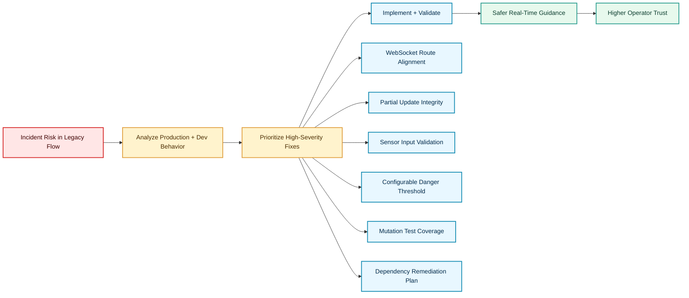
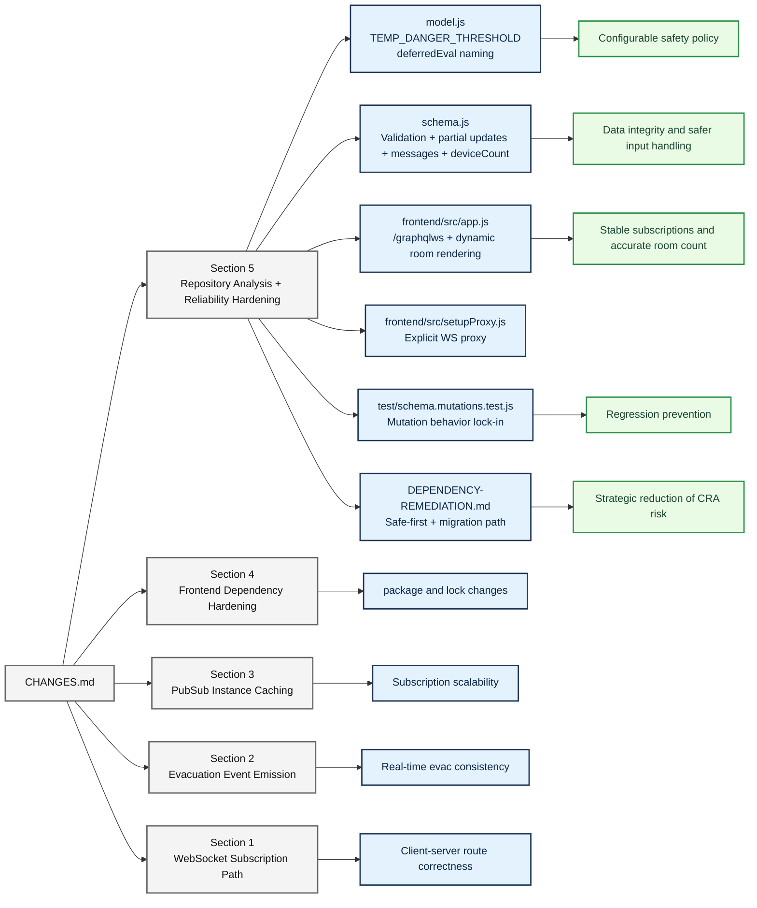
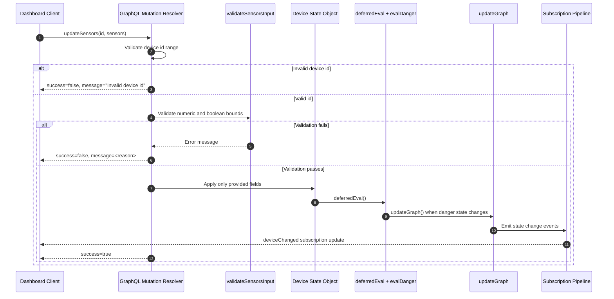
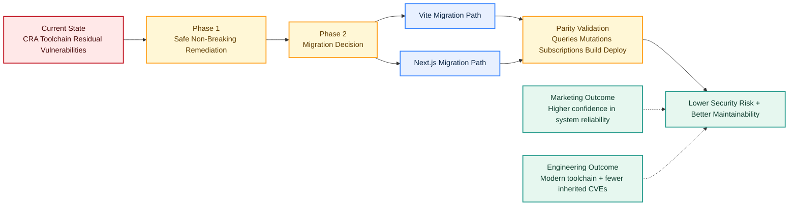

# Model Server Flowcharts

This document provides visual explanations of the architecture, recent reliability work, and impact from the change log.

## How to Read These Diagrams

- Business-oriented diagrams focus on user outcomes, risk reduction, and operational confidence.
- Engineering-oriented diagrams focus on runtime data flow, validation, state transitions, and subscriptions.
- All diagrams map directly to the work summarized in CHANGES.md.

---

## 1) Executive Change Story (Business + Engineering)



---

## 2) Runtime System Architecture and Data Flow

```mermaid
flowchart TB
    subgraph FE[Frontend Layer]
      FE1[React App]
      FE2[DeviceMonitor Cards]
      FE3[Apollo HTTP Link]
      FE4[Apollo GraphQL WS Link]
    end

    subgraph EDGE[Routing and Edge]
      R1[/graphql HTTP Route]
      R2[/graphqlws WebSocket Route]
      R3[Dev Proxy + NGINX Proxy]
    end

    subgraph BE[Backend Layer]
      B1[GraphQL Schema]
      B2[Mutation Resolvers]
      B3[Query Resolvers]
      B4[Subscription Resolvers]
      B5[PubSub Cache per Device]
    end

    subgraph MODEL[State and Safety Engine]
      M1[Device State Objects]
      M2[deferredEval]
      M3[validateSensorsInput]
      M4[evalDanger using TEMP_DANGER_THRESHOLD]
      M5[updateGraph Evacuation Mapping]
      M6[Event Emitters deviceChanged + ledStateChanged]
    end

    FE1 --> FE2
    FE1 --> FE3 --> R1
    FE1 --> FE4 --> R2
    R1 <--> R3
    R2 <--> R3

    R1 --> B1 --> B3 --> M1
    R1 --> B1 --> B2 --> M3 --> M2 --> M4 --> M5 --> M6
    M6 --> B5 --> B4 --> R2 --> FE4 --> FE2

    classDef frontend fill:#e8f1ff,stroke:#4361ee,stroke-width:2px,color:#14213d;
    classDef edge fill:#fff4e6,stroke:#f77f00,stroke-width:2px,color:#5a3d00;
    classDef backend fill:#f1f8e9,stroke:#2a9d8f,stroke-width:2px,color:#0b3d2e;
    classDef model fill:#fef6ff,stroke:#b5179e,stroke-width:2px,color:#4a154b;

    class FE1,FE2,FE3,FE4 frontend;
    class R1,R2,R3 edge;
    class B1,B2,B3,B4,B5 backend;
    class M1,M2,M3,M4,M5,M6 model;
```

---

## 3) CHANGES.md Implementation Impact Map



---

## 4) Safety Mutation Lifecycle (What Happens on updateSensors)



---

## 5) Dependency Strategy Roadmap for Mixed Audiences



## Suggested Usage

- Use Diagram 1 and Diagram 5 in cross-functional reviews.
- Use Diagram 2 and Diagram 4 in architecture and reliability discussions.
- Use Diagram 3 when walking through release notes and implementation traceability.
